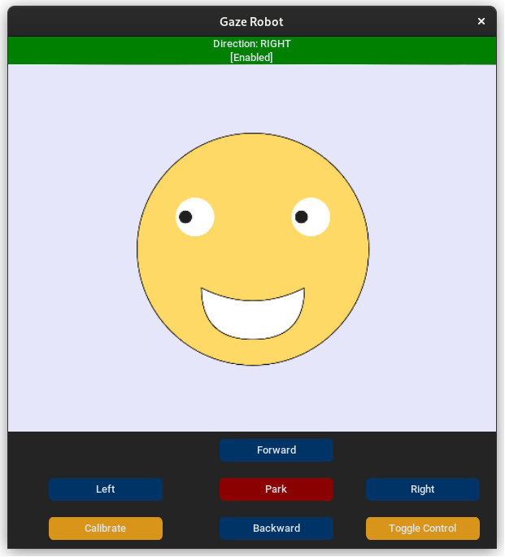
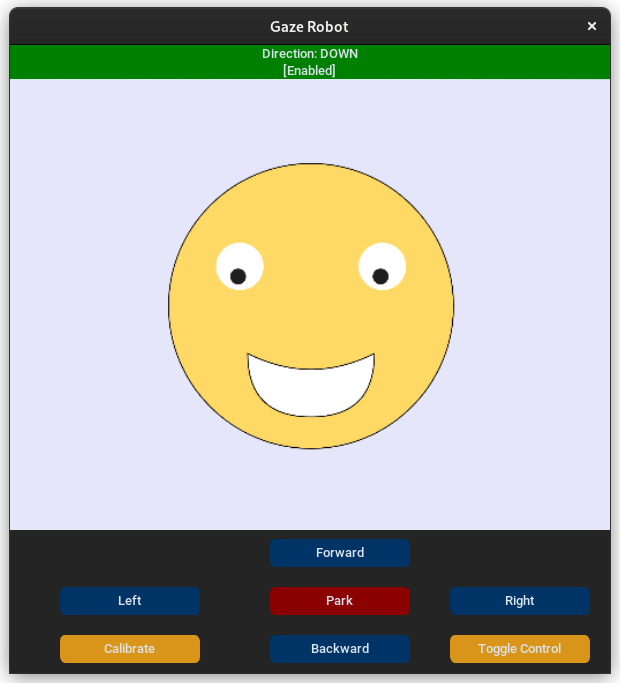
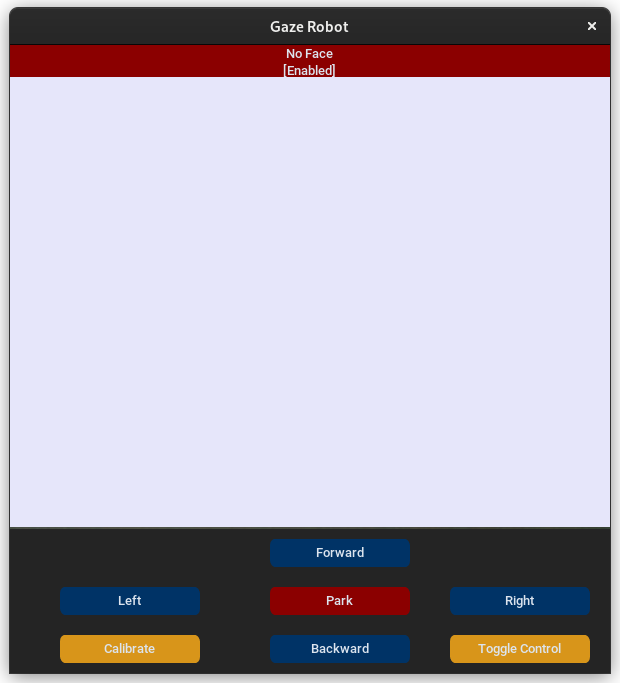
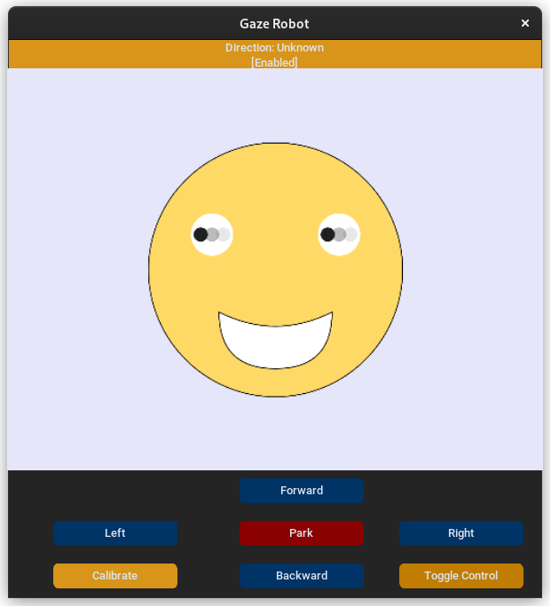

# Gaze Controlled Robot
## Usage
1. Clone this repository to your local machine.
2. Run `pip install -r requirements.txt` to install the required dependencies.
3. Boot the robot system and learn its ip address (see [robot control](helpers/robot_control.cpp)).
4. Run the script by executing `python main.py ip [args]`
5. Calibrate the gaze tracker by clicking the "Calibrate" button while looking at the center.
6. Control the robot by looking up (forward), right (turn right), left (turn left), down (backward), center (no move).

## Examples
| Screenshot | Description |
| --- | --- |
|  | The gaze tracker has recognized the user is looking at the center. |
|  | The gaze tracker has recognized the user is looking at the left direction. |
|  | The gaze tracker has recognized the user is looking at the right direction. |
|  | The gaze tracker has recognized the user is looking at the up direction. |
|  | The gaze tracker has recognized the user is looking at the down direction. |
|  | The gaze tracker has not detected a face. |
|  | The gaze tracker has not recognized the gaze direction (sudden movement, multiple directions, etc.). |

## License

This repository is licensed under the MIT license. Please see the LICENSE file for more information.
